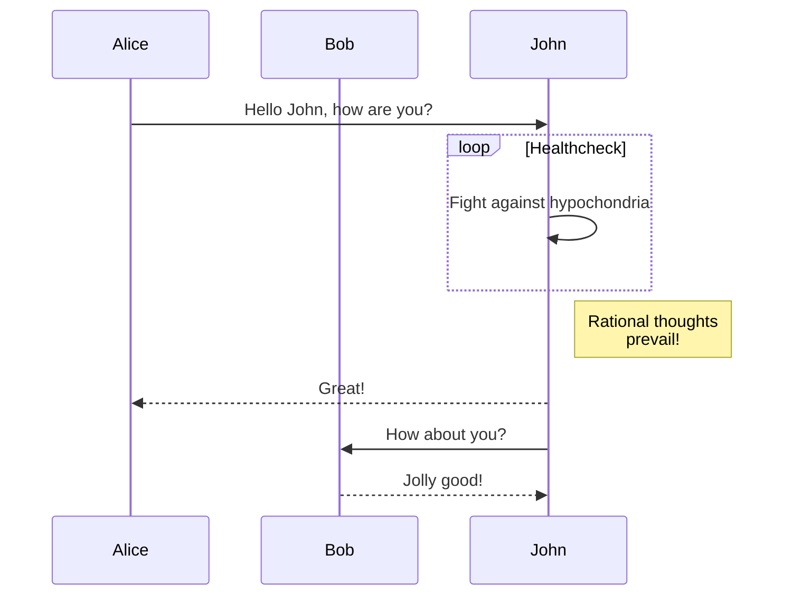

那就来记一些东西吧(●'◡'●)

#### 这是标题写法
- 大圆点写法

[链接写法][1]

[1]: https://zichuantang.github.io

`代码写法`

```
长代码，可copy。
```

> 这个是这种
<!--下面这行是改样式-->
{: .block-tip }

(写不动了，下面偷懒了)[^1]
1. a
2. b
3. c
4. d

+ 1
+ 2
+ 3
+ 4


<div class="table-wrapper" markdown="block">

|title1|title2|title3|title4|title5|title6|title7|title8|
|:-:|:-:|:-:|:-:|:-:|:-:|:-:|:-:|
|1|2|3|4|5|6|7|8|
|1|2|3|4|5|6|7|8|
|1|2|3|4|5|6|7|8|
|1|2|3|4|5|6|7|8|

</div>

> 这是绿色样式
{: .block-tip }
> 这是黄色样式
{: .block-warning }
> 这是红色样式
{: .block-danger }




When $a \ne 0$, there are two solutions to $ax^2 + bx + c = 0$ and they are

$$x = {-b \pm \sqrt{b^2-4ac} \over 2a}.$$

[^1]: [1](http://localhost:4000/jekyll/2025-03-10-%E7%AC%AC%E4%B8%80%E7%AF%87%E5%8D%9A%E5%AE%A2.html)
